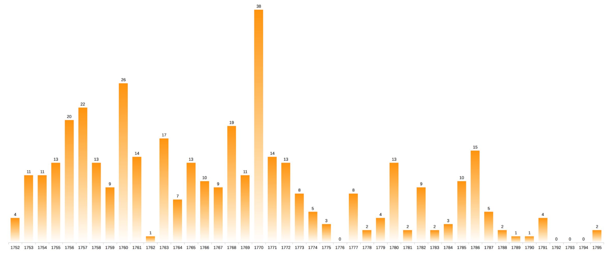
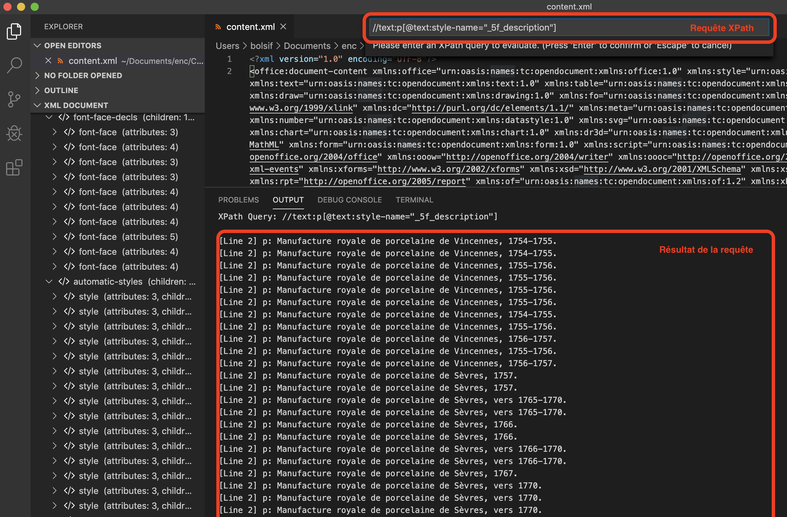

Calc – inventaire des porcelaines
===

**Objectifs :**

* Comprendre comment exporter les données du fichier traitement de texte.
* Découvrir les fonctionnalités de base d’un tableur.
* Visualiser la distribution chronologique des pièces de l’inventaire restructuré.



## 1. Export TSV des données de l’inventaire

### Dézipper `inventaire.odt`

Dans le Terminal (ligne de commande) :

```bash
unzip inventaire.odt
Archive:  inventaire.odt
 extracting: mimetype                
 extracting: Thumbnails/thumbnail.png  
  inflating: layout-cache            
  inflating: Configurations2/accelerator/current.xml  
   creating: Configurations2/statusbar/
   creating: Configurations2/popupmenu/
   creating: Configurations2/images/Bitmaps/
   creating: Configurations2/menubar/
   creating: Configurations2/floater/
   creating: Configurations2/toolbar/
   creating: Configurations2/progressbar/
   creating: Configurations2/toolpanel/
  inflating: manifest.rdf            
  inflating: settings.xml            
  inflating: meta.xml                
  inflating: META-INF/manifest.xml   
  inflating: styles.xml              
  inflating: content.xml  
```

### XML

Ouvrir [`content.xml`](./files/content.xml) avec un éditeur XML :

* Gratuit (et *Open source*) : [Visual Studio Code](https://code.visualstudio.com/) + l’extension [XML Tools](https://marketplace.visualstudio.com/items?itemName=DotJoshJohnson.xml)
* Payant : [Oxygen XML Editor](https://www.oxygenxml.com/xml_editor.html)

C’est un peu le bazar à première vue, mais à y regarder de plus près, on y retrouve sous forme de [balises (XML)](https://fr.wikipedia.org/wiki/Extensible_Markup_Language) toute la structuration inscrite au [stylage dans Writer](https://github.com/architexte/cours-document-structure/blob/master/tutoriel-writer.md). La valeur des [attributs](https://fr.wikipedia.org/wiki/Extensible_Markup_Language#Attributs) reprend le nom des styles personnalisés que nous avions créés : `description`, `inventaire` et `dimensions` notamment.

#### XPath

Nous pouvons extraire facilement les valeurs des différents champs des notices grâce au langage de requête [XPath](https://fr.wikipedia.org/wiki/XPath).

* descriptions : `//text:p[@text:style-name="_5f_description"]`.  
= tous les paragraphes (`text:p`) dont le nom du style (`@text:style-name`) est `_5f_description`.
* cotes : `//text:p[@text:style-name="_5f_inventaire"]`
* dimensions : `//text:p[@text:style-name='_5f_dimensions']`

Exemple de requête XPath dans l’éditeur *Visual Studio Code* :


Problème : on obtient ainsi des listes de valeurs (pour chaque champs) mais on ne recupère pas facilement l’ensemble des champs relatifs à chaque notice.  

On souhaite obtenir les données structurées sous la forme d’un tableau :

|Cote|Titre|Description|Dimensions|
|----|-----|-----------|----------|
|Inv. Steve 4751. |Cuvette à fleurs « Courteille »|Manufacture royale de porcelaine de Vincennes, 1754-1755.|Dimensions : haut. : 0,193 m ; long. : 0,315 m .|
|Inv. Steve 232|Vase « Urne Antique »|Manufacture royale de porcelaine de Vincennes, 1754-1755.|Dimensions : haut. (sans couvercle): 0,274 m ; haut. (avec couvercle) : 0,295 m ; long. : 0,185 m ; larg. : 0,135 m .|
|Inv. Steve 4980|Vase « hollandais »|Manufacture royale de porcelaine de Vincennes, 1755-1756.|Dimensions : haut. : 0,181 m ; long. : 0,182 m ; larg. : 0,135 m .|
|Inv. Steve 4980|Socle|Manufacture royale de porcelaine de Vincennes, 1755-1756.|Dimensions : haut. : 0,045 m ; long. : 0,182 m ; larg. : 0,135 m ; haut. totale : 0,189 m.|
|Inv. Steve 4981|Vase « hollandais »|Manufacture royale de porcelaine de Vincennes, 1755-1756.|Dimensions : haut. : 0,178 m ; long. : 0,187 m ; larg. : 0,135 m.|
|etc.|

Le langage de transformation [XSLT](https://fr.wikipedia.org/wiki/Extensible_Stylesheet_Language_Transformations) peut nous y aider.

#### XSLT
on peut extraire l’information structurée dans `content.xml` :  

```xml
<?xml version="1.0" encoding="UTF-8"?>
<xsl:stylesheet version="1.0"
  xmlns:xsl="http://www.w3.org/1999/XSL/Transform"
  xmlns:office="urn:oasis:names:tc:opendocument:xmlns:office:1.0"
  xmlns:text="urn:oasis:names:tc:opendocument:xmlns:text:1.0"
  exclude-result-prefixes="office text">
  <xsl:output method="text" encoding="UTF-8"/>
  <xsl:variable name="sep">
    <xsl:text>	</xsl:text><!-- définition du séparateur de colonnes : tabulation (\t) -->
  </xsl:variable>
  <xsl:template match="/">
    <xsl:apply-templates select="office:document-content/office:body/office:text/text:p[@text:style-name='_5f_inventaire']"/>
  </xsl:template>
  <xsl:template match="text:p[@text:style-name='_5f_inventaire']">
    <xsl:value-of select="."/>
    <xsl:value-of select="$sep"/>
    <xsl:value-of select="preceding-sibling::text:h[@text:outline-level='2' or @text:outline-level='3'][1]"/>
    <xsl:value-of select="$sep"/>
    <xsl:value-of select="preceding-sibling::text:p[@text:style-name='_5f_description'][1]"/>
    <xsl:value-of select="$sep"/>
    <xsl:value-of select="preceding-sibling::text:p[@text:style-name='_5f_dimensions'][1]"/>
    <xsl:text>
</xsl:text>
  </xsl:template>
</xsl:stylesheet>
```

Dans le Terminal (ligne de commande) :

```bash
xsltproc -o inventaire.tsv inventaire2tsv.xsl content.xml
```

On transforme (`xsltproc`), grâce à la feuille de transformation [`inventaire2tsv.xsl`](./files/inventaire2tsv.xsl) le fichier [`content.xml`](./files/content.xml). Le fichier de sortie (`-o` pour *output*) [`inventaire.tsv`](./inventaire.tsv) contient les données tabulaires.


#### Format TSV
> **Tab-separated values** (TSV) est un format texte ouvert représentant des données tabulaires sous forme de « valeurs séparées par des tabulations ». (...) Chaque ligne correspond à une rangée du tableau et les cellules d'une même rangée sont séparées par une tabulation.

[https://fr.wikipedia.org/wiki/Tabulation-separated_values](https://fr.wikipedia.org/wiki/Tabulation-separated_values)

## 2. Corriger et préparer la donnée pour l’analyse
* Ouvrir `inventaire.tsv` avec LibreOffice Calc et l’enregistrer au format `.ods`
* Ajouter des "étiquettes" aux colonnes
* **Contrôler** la donnée (dimensionner les colonnes, zoom, filtres)
* nettoyer grossièrement (supprimer les enregistrements lacunaires)
* normaliser la ponctuation à la fin des champs (cotes et dim.) : sélection active + Regex (`' ?\. *$/'`)

### 2.1. Normaliser les cotes (recherche contextuelle)
* search: `.*(Steve [0-9]+).*`
* replact: `$1`

### 2.2. Extraire les dates (fonctions)
* repérer toutes les dates : `=CHERCHE("[0-9]{4}";C2)`
  * NB: autoriser les Regex dans les calculs (`Préférences… > LibreOffice Calc > Calcul > Autoriser les expressions régulières dans les formules`)
  * Étirer la **formule** et comprendre les **références**
  * Comprendre le résultat de la fonction `CHERCHE()`
* Extraire la première date des descriptions : `=STXT(C2;CHERCHE("[0-9]{4}";C2);4)`

### 2.3. Déporter la donnée calculée
* Copier/coller la liste des dates dans une nouvelle **Feuille** dédiée à la génération de la visualisation.  
`Collage spécial…` et `Coller uniquement`
* Problème : l’apostrophe qui précède les nombres (dates) est gênante pour les calculs…
  1. Sélectionner les cellules concernées (attention à ne pas inclure dans la sélection de cellules contenant une formule).
  2. Sélectionner le menu `Données > Texte en Colonnes…`
  3. Dans la boite de dialogue qui apparaît, cliquer simplement sur `OK` sans rien changer.

## 3. Construire le diagramme

### 3.1. Calculer la donnée utile
* Établir la chronologie : dates min (`MIN()`) et date max (`MAX()`).  
  Comprendre la notion de **plage de données**.
* Construire la liste continue des dates sur la chrnologie établie (1752-1795) : les **séries**.
* Calculer les effectifs par année (le nombre de pièces de l’inventaire pour chaque année) : `NB.SI()`
  * Revoir la notion de **plage** (plage / critère pour NB.SI())
  * Étirer la formule.
  * Attention aux **références relatives et absolues** : `=NB.SI(A$1:A$379;C1)`
* **Contrôler** la donnée calculée (`SOMME()`)
* Calculer le nombre moyen de pièces par année (rechercher la formule et sa doc dans l’*Assistant fonctions*).

### 3.2. Insérer le diagramme
* Sélectionner la plage utile
* `Insertion > Diagramme…`
* `Séries de données en colonnes` : date, effectif
* `Première colonne comme étiquette` : date en abscisse et effectif en ordonnée
* Reprendre la présentation par défaut :
  * Supprimer la légende si présente
  * Redimensionner
  * Édition des séries de données (Option espacement, zone couleur, etc.)
  * Formater les étiquettes des données
  * Axes et Grille
* Exporter (PNG) le diagramme produit (`clic droit > Exporter comme image`).
