# Restructuration d’une édition
L’objectif de cet exercice est de comprendre les principes du document structuré, et les bénéfices attendus de la bonne structuration des données textuelles.

Enjeux
* éditoriaux (produire une belle édition, générer la table des matières, exporter) ;
* documentaire (contrôler la qualité des données saisies) ;
* scientifiques (exploiter les données de son édition).

Pré-requis
* [LibreOffice **5.3.7**](https://fr.libreoffice.org/download/libreoffice-stable/), avec le pack français installé.
* Nous utiliserons les [expressions régulières](https://help.libreoffice.org/Common/List_of_Regular_Expressions/fr).

**Cas.** Un chercheur a construit un inventaire de porcelaines. Le travail scientifique est rigoureux, mais l’édition ne permet de générer ni une impression de qualité, ni un export (PDF, HTML) convenable. Surtout, nous ne pouvons pas contrôler la qualité des données saisies (nombre de pièces décrites dans l’inventaire, dates, etc.), ou exporter les champs utiles à l’exploitation scientifique de l’inventaire. Nous chercherons par exemple à visualiser la distribution chronologique de cet inventaire.  
NB. Le document `inventaire.doc` utilisé pour l’exercice est un extrait.

La restructuration du fichier est l’occasion d’aborder :
* les formats de fichier (`.doc`, `.docx`, `.odt`)
* les styles de paragraphe
* les styles personnalisés
* le cherche/remplace (regex, sélection active, style de paragraphe)
* la numérotation des chapitres
* la génération de table des matières
* les exports

# Diagnostique du fichier source `inventaire.doc`
* ouvrir `inventaire.doc`
* convertir `inventaire.doc` en ODT  
`Fichier > Enregistrer-sous…` : dans le menu déroulant `Type de fichier`, sélectionner [`Texte ODF (.odt)`](https://fr.wikipedia.org/wiki/OpenDocument)

Quels sont les problèmes ?
* C’est moche !
* La structure de l’édition est difficile à appréhender.
  * Quelle est la structure logique de l’inventaire (la table des matières) ?
  * Le "stylage" du document est baroque (les styles sont appliqués sans aucune rigueur).
  * À quoi correspond(ent) la/les numérotation(s) ?
* Contrôle des données.
  * La numérotation est-elle fiable ?
  * Comment insérer un nouvel objet dans l’inventaire et mettre à jour cette numérotation ?

# Restructuration de l’inventaire

## Configuration de Calc
* Afficher le **Navigateur** : `Affichage > Navigateur` ou `F5`
* Afficher la fenêtre **Styles et formatage** : `Affichage > Styles et formatage`
* Paramétrer la **numérotation des chapitres** : `Outils > Numérotation des chapitres`
  * Attribuer le style *adhoc* à chaque niveau de titre (`Titre 1`pour 1, `Titre 2` pour 2, etc.)
  * Définir la numérotation et la mise en forme pour chaque niveau de titre (on choisit ici `Nombre : Aucun`). Attention, penser à supprimer les espaces inutiles autour du `Séparateur`.

## Nettoyer le document
Plutôt que de formater manuellement les titres (changement de police, graisse, taille, couleur, etc.), nous utilisons les **styles de paragraphe** pour identifier les parties de l’inventaire.

### Suppression des paragraphes vides
**Problème.** Nous avons de nombreux paragraphes vides gênants pour la reprise du document. L’espacement entre paragraphes est une propriété du style de paragraphe (voir plus bas), mais ne doit pas être géré avec des paragraphes vides.  
Pour supprimer ces paragraphes vides :
* **Rechercher :** `^$`  
NB : penser à cocher la case `Expressions régulières` dans les `Autres options`de la boîte `Rechercher & remplacer`.
* **Remplacer :** `laisser le champ vide`

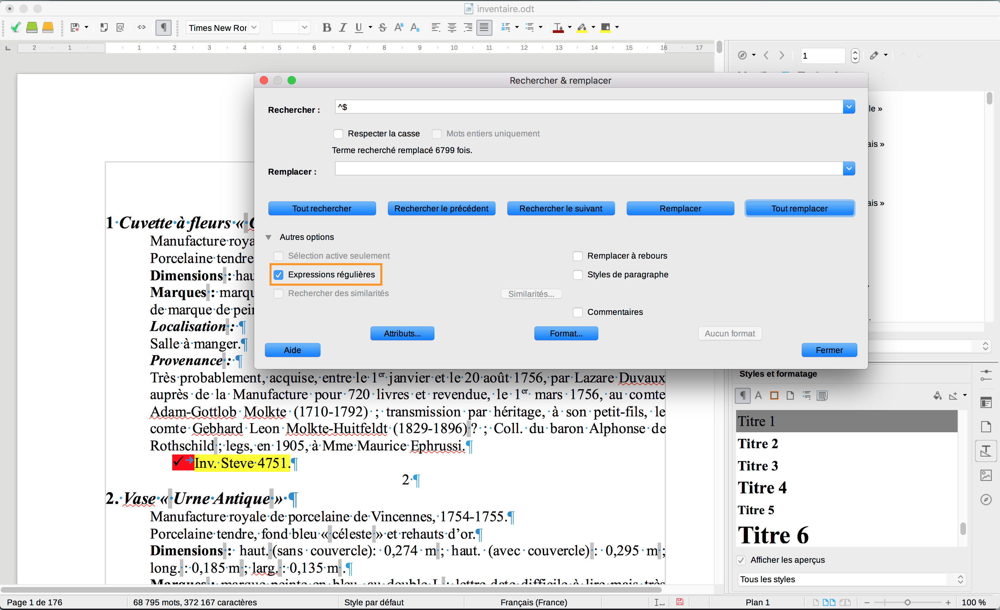

### Supprimer tous les styles de paragraphe appliqués
**Problème.** Plusieurs styles de paragraphes sont utilisés dans le document (dans la fenêtre `Styles et formatage`, cocher l’icône `¶` pour afficher les `styles de paragraphe`, puis sélectionner en bas de la fenêtre le filtre `Styles appliqués`). Mais ces styles sont utilisés de manière très aléatoire.

**Établir ce diagnostic.** Ouvrir la fenêtre de recherche (`Édition > Chercher et remplacer…`), dans `Autres options`, cocher `Styles de paragraphe` : vous pouvez ainsi rechercher tous les paragraphes d’un syle déterminé, par exemple `Retrait corps de texte 3`. On constate que ce dernier style est utilisé pour des paragraphes très différents (cote, description, provenance, etc.).

Une même recherche sur les styles `Titre 1` permet de constater que le style est appliqué pour des entrées d’inventaire (numérotation numérique), mais aussi pour des sous-entrées (numérotation alphabétique), ou des numérotations saisies manuellement. En conséquence, la table des matières visible dans le `Navigateur` est complètement fautive :

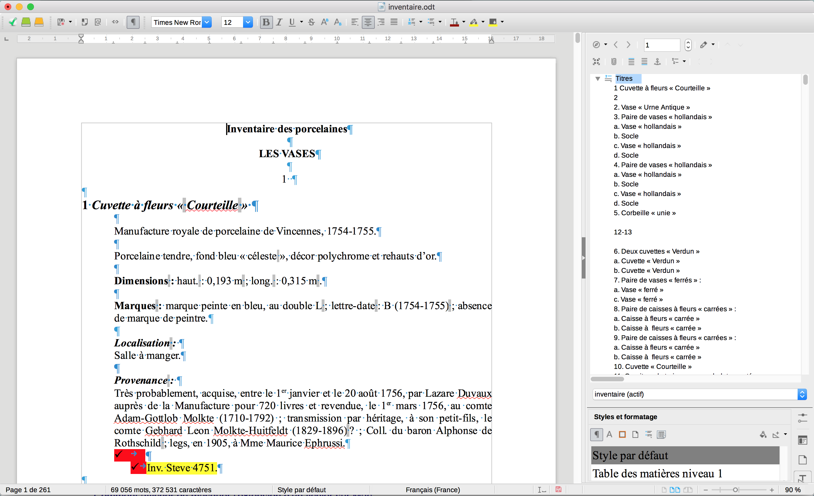

**Choix.** Dans ce document le stylage est source de confusion. Nous prenons la décision de le supprimer pour le reconstruire.  
**ATTENTION.** Ce choix est justifié dans le contexte de cet exercice (le fichier est vraiment mal structuré, c’est utile pédagogiquement, et surtout, nous pourrons restructurer le document grâce à d’autres éléments de l’édition). **Il faut toujours analyser le document avant d’adopter une stratégie de reprise**.

**Basculer tous les styles de paragraphes du document en `Style par défaut` (sauf `Note de bas de page`).**
* Ouvrir la boîte `Chercher et remplacer…`, dans `Autres options`, cocher `Styles de paragraphe`.
* En `Rechercher`, sélectionner le style à remplacer, en `Remplacer`, sélectionner `Style par défaut`.
* Répéter l’opération pour chaque style à supprimer (tous sauf `Note de bas de page`).
Pour `Titre 1`, avant remplacer :  

  

Après : noter la modification de la table des matières dans le `Navigateur`.  

  

### Initialiser l’alignement des paragraphes
**Problème.** La mise en forme reste assez baroque, avec des "effets d’escalier" (cf gestion du retrait des paragraphes). On choisit de rétablir l’alignement à gauche.
* Sélectionner tout le texte (`Édition > Tout sélectionner` ou `CRTL+A` ou `cmd+A`).
* `Format > Paragraphe…`: redéfinir à 0 les valeur de retrait.

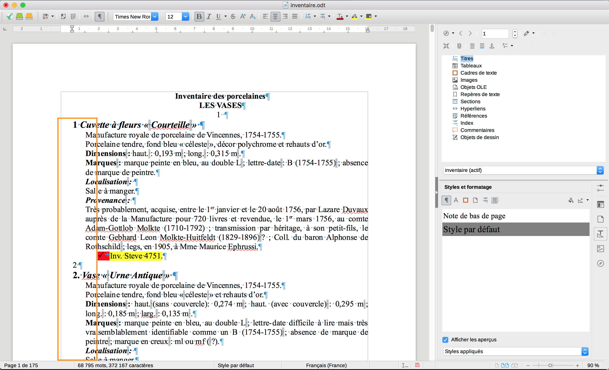  
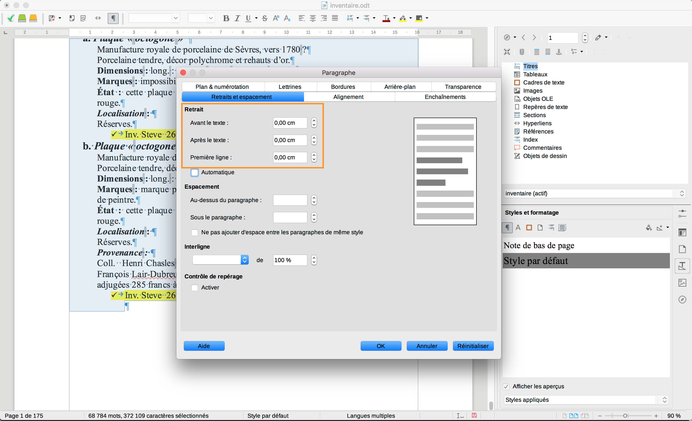  
  

### Suppression de la numérotion inscrite manuellement par l’auteur de l’inventaire
**Problème.** Certaines entrées de l’inventaire contiennent plusieurs objets (cotes). L’auteur a inscrit une numérotation manuellement pour compter ces entrées. Cette numérotation est problématique : on ne peut pas la contrôler ; on ne peut pas insérer une nouvelle entrée, à moins de reprendre manuellement toute la numérotation qui suit cette nouvelle entrée… Nous décidons de supprimer cette numérotation inutile, voire fautive.
* Ouvrir la boîte `Chercher et remplacer…`, dans `Autres options`, cocher `Expressions régulières`.
* Rechercher : `^[0-9]+ *$`
* Remplacer : `laisser le champ vide`
* **NB.** Toujours tester son expression régulière avec `Tout rechercher` avant de `Tout remplacer`.
* Supprimer les paragraphes vides créés (voir ci-dessus).

  
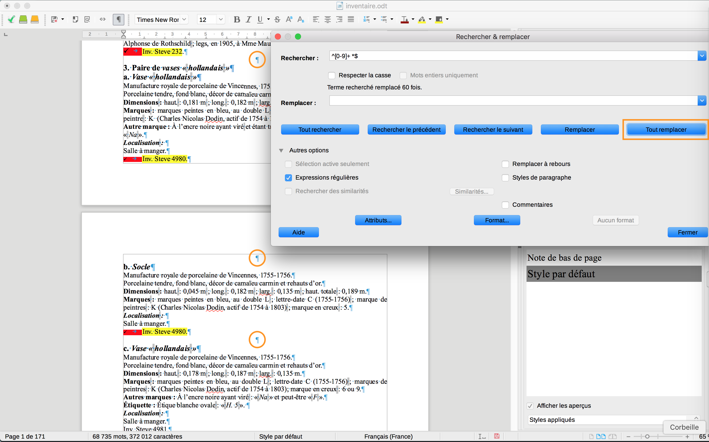  

### Inscrire les titres de niveau

#### Titre principal
Le titre de l’inventaire, *Inventaire des porcelaines*, n’est pas un titre de partie, mais bien le titre du document. On utilise le style `Titre principal`

**NB.** Pour styler un paragraphe, il n’est pas utile de le sélectionner (le mettre en surbrillance), il suffit de placer le curseur n’importe où dans ce parapraphe, puis de double-cliquer sur le style choisi dans la fenêtre `Styles et formatage`. Le style s’applique bien à tout le paragraphe contexte. La logique est bien sûr différente pour les "styles de caractère".

  

**NB.** Le résultat est moche. Pas grave, ce qui importe ici, c’est de bien visualiser la structure du document. Nous verrons plus tard comment utiliser les styles pour produire une mise en forme plus agréable.

#### Titre 1
Nous ne pouvons pas les repérer automatiquement. Il faut faire défiler les pages pour les identifier.
* p. 1 : "Les vases"
* p. 7 : "Les pièces de déjeuners"
* P. 86 : "Les éléments de services de table"

Penser à **basculer les titres en minuscules**.
  * Il est facile de passer des minuscules aux MAJUSCULES ; l’inverse ne l’est pas…
  * La casse doit être une propriété du style.

**ATTENTION aux titres sur 2 lignes**, ici "Les éléments de services de table". L’auteur a insérer un saut de paragraphe entre les 2 lignes du titre. On obtient logiquement 2 parties (cf le `Navigateur`) dont la première est vide… Pour imprimer un texte sur 2 lignes, il faut insérer un saut de ligne (`MAJ+Entrée`).

  
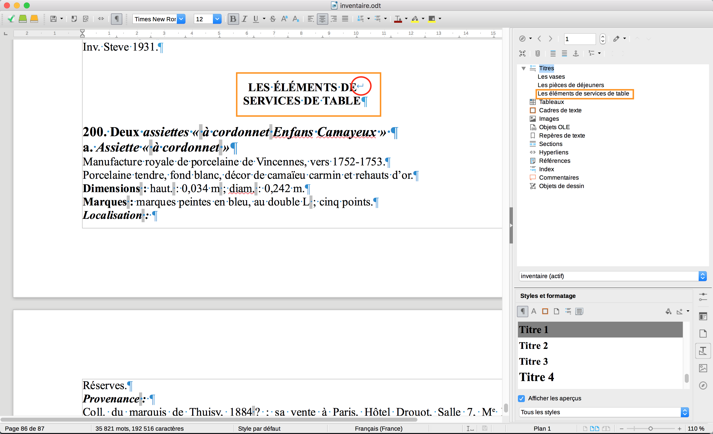  
  

#### Titre 2
Ici, les titres de niveau 2 correspondent aux entrées de l’inventaire que l’auteur avait pris soin de numéroter manuellement. Nous allons exploiter cette numérotation pour styler automatiquement ces titres.  
Il serait (très) fastidieux de devoir les styler manuellement, un à un, comme nous venons de le faire pour les titres de premier niveau…
* Rechercher : `^[0-9]+\.` (penser à cocher l’option `Expressions régulières`)  
Tous les chiffres (`[0-9]`) ou nombres (`+`) suivis d’un points (`\.`) ancrés en début de ligne (`^`).
* Cliquer sur `Tout rechercher` : toutes les occurrences sont surlignés.
* **Vérifier que le résultats correspond bien à nos attentes** avant de poursuivre.
* Double-cliquer sur `Titre 2` dans la fenêtre `Styles et formatage`.  
Le style s’applique bien à tous les paragraphes contexte de la sélection (il est inutile de sélectionner tout le texte du titre pour appliquer le style de paragraphe).

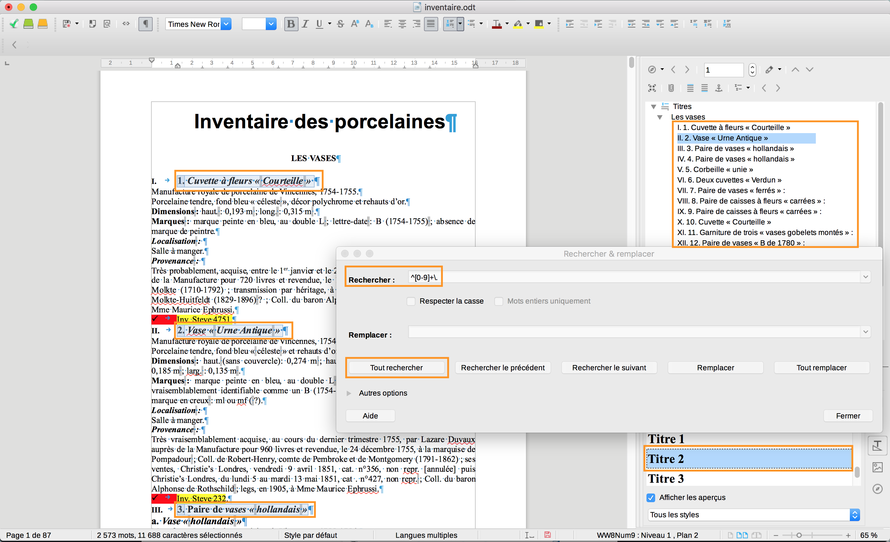  

**NB.** La table des matières se met à jour dans le navigateur.  
**NB.** Une numérotation automatique gênante peut apparaître. Elle est dûe au style `Titre 2` tel qu’il est défini dans le document source. Pour la supprimer :
* Clic doit sur `Titre 2`dans la fenêtre `Styles et formatage`.
* Onglet `Plan & numérotation`, sélectionner `Aucun(e)` dans la liste déroulante `Style de numérotation`.

  

#### Titre 3
Dans notre inventaire, les titres de niveau 3 correspondent aux sous-entrées, identifiées par un numéro d’inventaire. L’auteur a pris soin de poser une numérotation alphabétique que nous allons exploiter pour styler automatiquement ces titres.
* Rechercher : `^[a-z]{1,2}\.`  
Tous les lettres (`[a-z]`), éventuellement doubles (`{1,2}`) suivis d’un points (`\.`) ancrés en début de ligne (`^`).
* Cliquer sur `Tout rechercher` : toutes les occurrences sont surlignés.
* **Vérifier que le résultats correspond bien à nos attentes.**
* Double-cliquer sur `Titre 3` dans la fenêtre `Styles et formatage`.
* Idem que précédemment pour supprimer la numérotation automatique attachée au style `Titre 3`.

**Problème.** Certaines sous-entrées n’ont pas été identifiées car l’auteur a parfois utilisé les listes à puces pour les lister (décidément…). Pour bien faire (aboutir ce travail), il faudrait **reprendre ces quelques cas manuellement** !

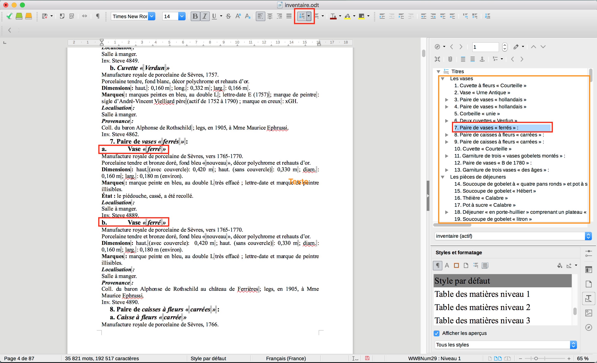  

Notre table des matières est assez satisfaisante. Il faudrait la valider manuellement (il y a toujours des erreurs qui traînent). Cette partie du travail est toujours la plus longue et la plus fastidieuse.

#### Numérotation automatique
La numérotation manuelle de l’auteur est potentiellement fautive. Puisque que les entrées sont à présent bien marquées (`Titre 2`), nous pouvons utiliser les propriétés du style `Titre 2` pour numéroter automatiquement les entrées.

**1. Suppression des numérotations manuelles** (Regex + recherche contextuelle)
1. Ouvrir la boîte `Chercher et remplacer…`, dans `Autres options`, cocher `Styles de paragraphe`.
1. Rechercher : sélectionner `Titre 2` dans le menu déroulant.
1. Cliquer sur `Tout rechercher` pour sélectionner tous les `Titre 2`
1. Dans `Autres options`, décocher `Styles de paragraphe`.
1. Dans `Autres options`, cocher `Sélection active seulement` et `Expressions régulières` pour ne faire un cherche-remplace que dans la sélection des `Titre 2`établie précédemment.
1. Rechercher : `^[0-9]+\. *`  
  Tout les nombres (`[0-9]+`) en début de ligne (`^`) suivis d’un point (`\.`) et d’un ou plusieurs espaces optionnels (`_*`).
1. Remplacer : `laisser le champ vide`
1. Reproduire l’opération pour les `Titre 3` (rechercher `^[a-z]{1,2}\. *`)
1. Corriger manuellement les cas qui résistent (le Navigateur est une vue de contrôle utile, qui permet d’accéder directement aux items à corriger : doucle-clic sur l’item de menu à corriger).

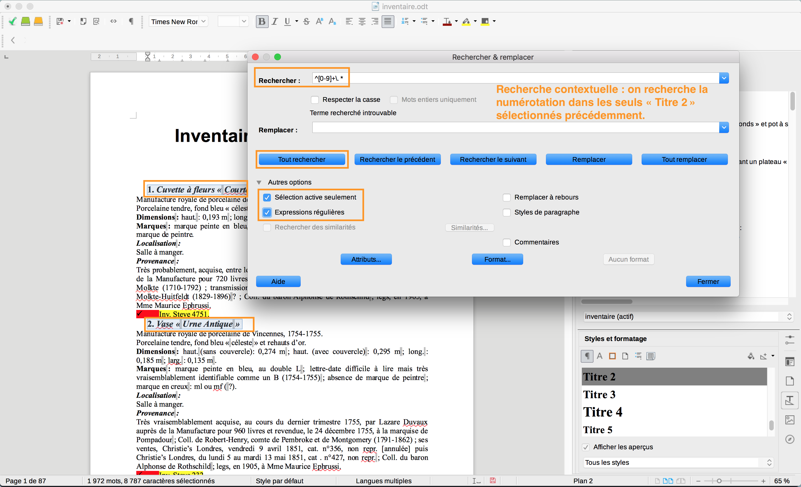
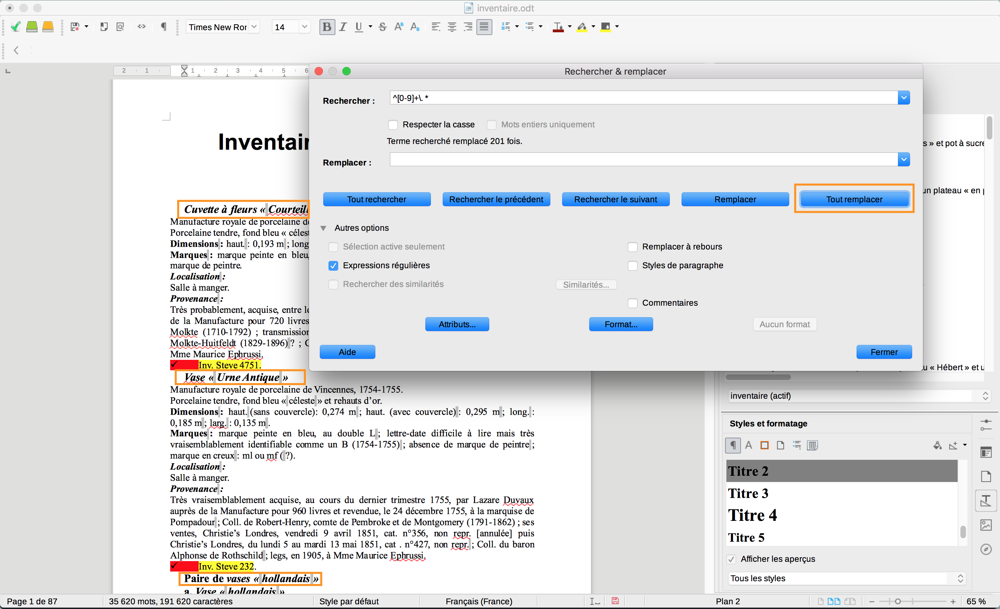

**2. Insertion de la numérotation automatique pour les entrées d’inventaire (`Titre 2`)**
* Dans la fenêtre `Styles et formatage`, clic droit sur `Titre 2` > `Modifier…`
* Dans l’onglet `Plan & numérotation`, sélectionner `Numérotation 1` dans le menu déroulant `Niveau de plan`.
* Cliquer sur `Appliquer`.
* La numérotation apparaît dans le `Navigateur`.

#### Générer la table des matières
* À la fin du document, insérer un saut de page (Menu `Insertion > Saut de page`).
* `Insertion > Table des matières et index > Table des matières, index ou bibliographie…`
* Cliquer sur `OK`.

NB. On ne peut pas éditer la table des matières, son contenu est généré grâce à partir des styles (`Titre 1`, `Titre 2`, `Titre 3`), en tenant compte du paramétrage défini dans le menu `Outils > Numérotation des chapitres …`  
Pour mettre à jour la table des matières (après avoir ajouté, corrigé ou supprimé des titres dans le document) : clic droit sur la table des matières > `Mettre à jour l’index`.

Nous venons de restructurer le texte de manière à rendre intelligible la structure de l’inventaire, permettre la numérotation automatique des entrées (qualité des données). Ce travail permet une validation documentaire de l’inventaire. Nous pourrions effectuer d’autres tâches grâces aux regex, par exemple la normalisation de la ponctuation qui est assez fautive.

À présent nous allons exploiter cette structuration pour produire un document présentable et générer des exports (enjeux éditoriaux).

# (Première) mise en forme grâce aux styles
Il suffit d’éditer les styles `Titre 1`, `Titre 2`, `Titre 3` (Dans la fenêtre `Styles et formatage`, clic droit sur le nom du style > `Modifier…`) pour améliorer la présentation.

Les principaux paramètres sur lesquels jouer :
* Onglet `Police` : choix de la police, graisse, taille.
* Onglet `Effets de caractère` : minuscules, MAJUSCULES, Petites majuscules.
* Onglet `Alignement` : à gauche, centré, etc.
* Onglet `Retraits et espacement`, gestion de l’**Espacement** vertical (au-dessus/sous le paragraphe) et de l’interlignage.
* Onglet `Enchaînements` : par exemple insérer un saut de page avant les `Titre 1`.
* Onglet `Bordures` : définir des séparateurs

Un exemple de mise en forme :

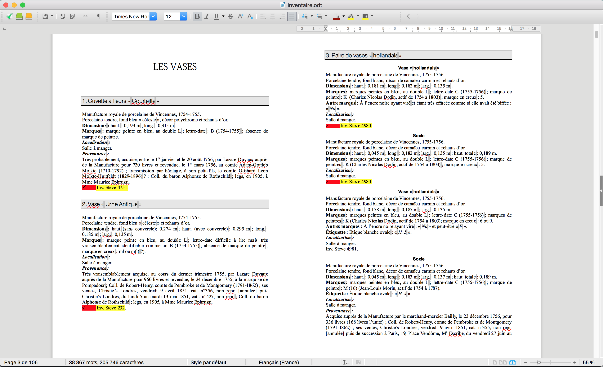

**IMPORTANT.** Si la modification des styles n’a pas d’effet sur la mise en forme, c’est qu’un **formatage direct** a été appliqué (par-dessus) : le formatage direct correspond à toutes la mise en forme appliquées sans avoir recours aux styles, par exemple la mise en italique d’un titre sélectionné. Pour rendre la priorité au style par défaut défini dans le style appliqué, il faut effacer cette couche de formatage direct, par exemple pour les `Titre 2` :
* Sélectionner tous les `Titre 2`(cf  `Rechercher & remplacer`, option `styles de paragraphe`)
* Puis dans le menu principal, en haut de la fenêtre de LibreOffice, cliquer sur `Format > Effacer le formatage direct`.  
Attention cette manipulation supprime l’enrichissement typographique (italique, gras) qui a pu être ajouté ; il faut donc manipuler avec précaution (risque de perdre de l’information).

Il reste pas mal de travail. Pour exploiter scientifiquement notre inventaire nous avons besoin de mieux structurer encore son contenu.

# Structuration sémantique de l’inventaire
Les notices de l’inventaire sont (assez) rigoureusement structurées. Pour visualiser la distribution chronologique, nous aurons besoin d’extraire systématiquement les dates exprimées dans le premier champ descriptif (paragraphe suivant le titre de l’entrée). Nous pourrions aussi souhaiter exporter les dimensions, ou la localisation.

Nous allons voir comment identifier chacun de ces champs (comme dans une base de données) grâce aux styles personnalisés.

## Styler les cotes d’inventaire
### Désactiver les puces
En l’état, la plupart des cotes sont marquées par une puce. On commence par les désactiver.
* `Tout rechercher` la regex `^Inv\.`
* Dans la barre d’outils, cliquer sur l’icône `(Dés)activer les puces`  
Pour afficher l’icône : `Affichage > Barres d'outils > Formatage`

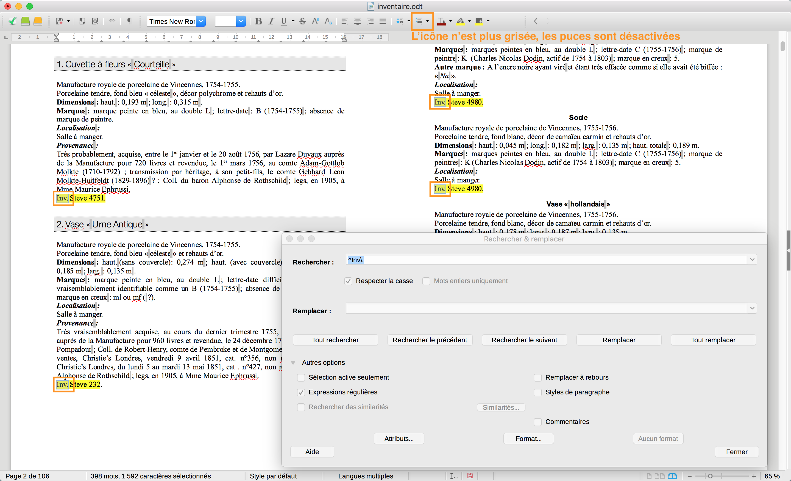

### Style personnalisé
Nous avons identifié les titres de niveau grâce aux styles. De la même manière, nous allons marquer les cotes d’inventaire. Évidemment, il n’existe pas par défaut de style "Cote d’inventaire" dans le modèle ODT. Mais nous pouvons créer un tel style pour notre besoin spécifique.
* Dans la fenêtre `Style et formatage`, clic droit sur un `Style par défaut > Nouveau…`
* Dans la boîte de dialogue, saisir le nom du nouveau style, ici `_inventaire`.  
NB. le préfixe "`_`" n’est pas nécessaire mais il permet de faire remonter le style tout en haut de la liste des styles. C’est pratique quand on souhaite regrouper tous les styles personnalisés dans la liste et y accéder rapidement.

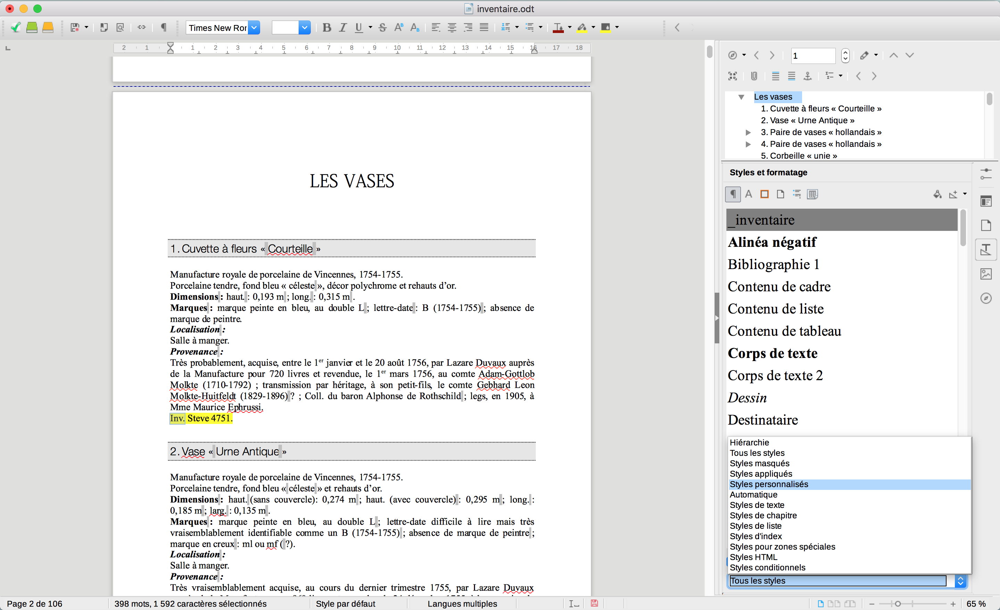

* Définir pour ce style une mise en forme qui fasse bien ressortir le paragraphe. La mise en valeur du style nous aide aussi, en déroulant le document, à contrôler que chaque notice est correctement structurée : nous voyons immédiatement si une notice a une cote ou non.

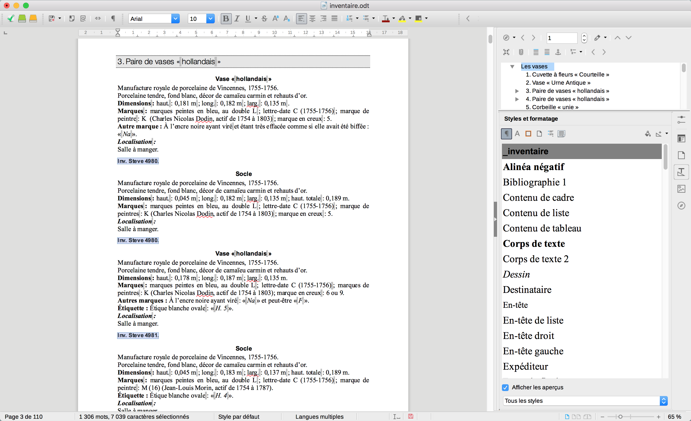

# Styler les champs *description* et les *dimensions*
* De la même manière, créer les styles `_description` et `_dimensions`.
* Définir une mise en forme qui mette en valeur l’identification de ces champs.
* Utiliser les `regex` pour sélectionner les paragraphes (`Tout rechercher`) :
  * Les "descriptions" débutent par la chaîne "Manufacture" : `^Manufacture`
  * Les "dimensions" débutent par la chaîne "Dimesions" : `^Dimensions`

Le rendu n’est pas joli, mais il permet de valider efficacement la structure de chaque notice. Nous modifierons la mise en forme des style pour produire une belle mise en page, pour l’impression noir et blanc.

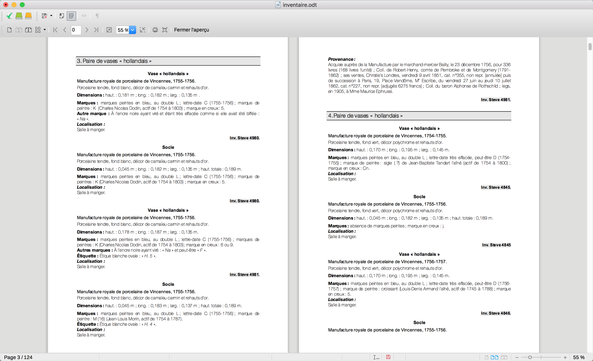

# Convertir le document
Le traitement de texte permet d’exporter l’inventaire en différents formats.

**PDF.** Cliquer sur l’icône `Exporter au format PDF` ou `Fichier > Exporter au format PDF`. L’export interprète les styles de manière à proposer une table des matières dynamiques.

**HTML.** `Fichier > Enregistrer sous…`. Sélectionner `Document HTML (Writer) (.html)` dans le menu déroulant `Type de fichier`.

D’autres formats sont disponibles, notamment `DOCX` et `DocBook` (XML).  
Les exports XML sont intéressants pour la récupération des données dans un document correctement structuré…

# Exporter les données
